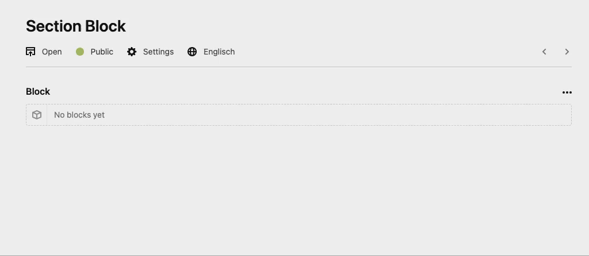

# Kirby Kirby Section Block (Beta)

## Overview

Section wrapper block that contains column blocks.

Due to the success of [Column Blocks](https://github.com/youngcut/kirby-column-blocks) and [Grid block](https://github.com/youngcut/kirby-grid-block), i've been created an improved version based on your suggestions.



## Features

⭐️ Easy setup section with custom fields in `blueprints/fields/section.yml`

⭐️ Easy setup columns with custom fields in `blueprints/fields/columns.yml`

⭐️ Define a collection of available columns types: `blueprints/columns/*.yml`.

⭐️ Setup styling per each columns type. Even with placeholders for the fields. -> Get deeper into wysiwyg.


> 
> **This Plugin is currently on beta: Use at your own risk.**
> 
> Contributors wanted! Please help me to improve this thing by posting your feedbacks or doing pull requests.
>
> **Bugs**
> - Lost focus on input of the content block
>
> **Missing Feature**
> - Paste
> - Parsley integration
> - Individual fielsset per column type
> - Change type button on main options bar
> 


## Installation

**Manually**

[Download](https://github.com/youngcut/kirby-section-block) and copy the plugin into your plugin folder: `/site/plugins/`

**With Composer**

`composer require microman/kirby-section-block:^1.0-beta`

## How to use

Just follow the [Kirby Blocks instructions](https://getkirby.com/docs/reference/panel/fields/blocks).

Set up your blueprint:

``` yaml
my_block:
    type: blocks
    fieldsets:
        - section
        ... even more if you like
```

Set up your output:

``` php
<?php foreach ($page->my_block()->toBlocks() as $block): ?>
   
    <?= $block ?>

<?php endforeach ?>
```

## Example

Let's make an example (like in the screenshot):

### Set up the section block

Let's say you want to give your editors the ability to set the maximum width of your section.

`site/blueprints/fields/sections.yml` (Keep in mind: `fields` folder not `blocks`!)
``` yml
fields:
  max_width:
    type: number
    after: px
```
*The section block has not possibilities to define the styling for the backend.*

### Set up the column block

Now, we set the background field. We can use the given value, later for our backend styling. And also we set a few fielsets for our content blocks.

`site/blueprints/fields/columns.yml`
```yml
fields:
  background:
    type: colors
    alpha: true
  content:
    fieldsets:
      - heading
      - text
```
*This setup needs a color field. Check [this](https://getkirby.com/plugins/hananils/colors) out...*

### Set up column types

You're free how much types you want to offer. But set at least one or delete the `blueprints/columns` folder for the 3 defaults.
Here we use *full width* for instance and set the styling for the backend. The background value comes from our color field we defined before.

`site/blueprints/columns/xxx.yml`
```xml
title: Full Width
icon: col_1_1
width: "1/1"
style:
    background: background
    border: 1px solid black
```

## Customize the output

The best way to do this, is to copy `snippets/blocks/section` from the plugin folder to your site folder.
You'il easely understanding, whats going on there.

Let me just say something about the `$column->column_width()` method (with *1/2* as example):

- Without any parameter, you'il get the original value like this: 1/2
- Set a number as parameter, the width will be divided by this: `column_width(100)` -> *50*  `column_width(12)` -> *6*
- Any other character is a separator: `column_width('_')` -> *1_2*

**Have fun with it!**

## License

MIT

> Show me your appreciation and [buy me a ☕️](https://www.paypal.com/donate/?hosted_button_id=5W5RBKYXBDABN)
